# PatientTriage.ai — Technical Specification & System Architecture (v2)

## 1. System Overview & Architectural Vision

PatientTriage.ai is an explainable, safety-biased clinical decision-support triage system designed for high-acuity emergency departments, rural critical access facilities, and distributed hospital networks.

The system combines **deterministic physiological safety gates** (calibrated against PEWS, NEWS2, and qSOFA), **active Value-of-Information (VOI) entropy reduction**, **serial vital velocity deterioration tracking**, and **neurosymbolic Clinical SLM entity extraction** within an air-gapped, zero-cloud-leak architecture.

```
                              [ Emergency Department Clients ]
                 (Paramedic Run-Sheets, Nurse Workstations, Bedside Vitals, Mobile Tablets)
                                              │
                         ┌────────────────────┴────────────────────┐
                         ▼ (REST / FHIR v4)                        ▼ (Web State / WS)
              ┌──────────────────────┐                  ┌──────────────────────┐
              │   FastAPI Ingestion  │                  │ Streamlit / Web HUD  │
              │     (FHIR Gateway)   │                  │  (Multi-Workstation) │
              └──────────┬───────────┘                  └──────────┬───────────┘
                         │                                         │
                         └────────────────────┬────────────────────┘
                                              ▼
+─────────────────────────────────────────────────────────────────────────────────────────────+
|                                    Domain Engine Layer                                      |
|                                                                                             |
|   ┌───────────────────────────┐    ┌───────────────────────────┐    ┌───────────────────┐   |
|   │     BaseTriageEngine      │    │         VOIEngine         │    │ PatientQueueRadar │   |
|   │ (Algorithmic / Hybrid SLM)│◄──►│  (10-Rule Entropy Bank)   │◄──►│ (Vital Velocity)  │   |
|   └─────────────┬─────────────┘    └─────────────┬─────────────┘    └─────────┬─────────┘   |
|                 │                                │                            │             |
|                 ▼                                ▼                            ▼             |
|   ┌───────────────────────────┐    ┌───────────────────────────┐    ┌───────────────────┐   |
|   │    Physiological Red-Line │    │  Facility Profile Engine  │    │ Dynamic Fast-Track│   |
|   │   (PEWS / NEWS2 / qSOFA)  │    │  (YAML Facility Adapters) │    │  (Surge Diversion)│   |
|   └───────────────────────────┘    └───────────────────────────┘    └───────────────────┘   |
+─────────────────────────────────────────────┬───────────────────────────────────────────────+
                                              │
                                              ▼
+─────────────────────────────────────────────────────────────────────────────────────────────+
|                                  Persistence & State Layer                                  |
|                                                                                             |
|        ┌───────────────────────────────────┐    ┌───────────────────────────────────┐       |
|        │      QueueRepository Contract     │    │      AuditRepository Contract     │       |
|        └─────────────────┬─────────────────┘    └─────────────────┬─────────────────┘       |
|                          │                                        │                         |
|             ┌────────────┴────────────┐              ┌────────────┴────────────┐            |
|             ▼                         ▼              ▼                         ▼            |
|   [SqliteQueueRepository]     [NATS JetStream] [FileAuditRepository]    [PostgreSQL DB]     |
|     (WAL Mode / Multi-Tab)     (Enterprise)     (SHA-256 De-identified)  (Enterprise BAA)   |
+─────────────────────────────────────────────────────────────────────────────────────────────+
```

---

## 2. End-to-End Component Flowchart (Mermaid)

```mermaid
flowchart TD
  classDef service fill:#e1f5fe,stroke:#0288d1,stroke-width:2px;
  classDef component fill:#e8f5e9,stroke:#388e3c,stroke-width:2px;
  classDef data fill:#fff3e0,stroke:#f57c00,stroke-width:2px;
  classDef metric fill:#f3e5f5,stroke:#7b1fa2,stroke-width:2px;
  classDef decision fill:#fbe9e7,stroke:#d84315,stroke-width:2px;

  fhir_api["FastAPI FHIR v4 Gateway<br/><small>(service: /Observation, /Patient)</small>"]
  app["Clinical Decision Support HUD<br/><small>(service: Streamlit/Web)</small>"]
  
  triage_models["Clinical Data Contracts<br/><small>(data: Pydantic v2 Models)</small>"]
  facility_profile["Facility Profile Engine<br/><small>(component: YAML Schema)</small>"]
  
  subgraph Decision_Core["Neurosymbolic Decision Core"]
    slm_extractor["Clinical SLM Entity Extractor<br/><small>(component: Gemma/Qwen/Fallback)</small>"]
    triage_engine["Algorithmic Triage Engine<br/><small>(component: BaseTriageEngine)</small>"]
    triage_rules["Physiological Red-Lines & Meds<br/><small>(component: RuleRegistry)</small>"]
    triage_voi["Expanded VOI Engine (10 Rules)<br/><small>(component: Active Q&A)</small>"]
  end

  subgraph State_Management["Concurrency & Audit State"]
    sqlite_queue["Concurrent SQLite WAL Queue<br/><small>(component: SqliteQueueRepository)</small>"]
    hipaa_audit["HIPAA Safe Harbor Ledger<br/><small>(component: AuditLogger SHA-256)</small>"]
  end

  dec_008["DEC-008: Distributed Horizon<br/><small>(decision)</small>"]
  dec_009["DEC-009: Web Hosting Strategy<br/><small>(decision)</small>"]
  dec_010["DEC-010: FHIR v4 Ingestion<br/><small>(decision)</small>"]
  dec_011["DEC-011: SQLite WAL Persistence<br/><small>(decision)</small>"]
  dec_012["DEC-012: Hybrid SLM Neurosymbolic Core<br/><small>(decision)</small>"]
  dec_013["DEC-013: Declarative Facility Profiler<br/><small>(decision)</small>"]

  fhir_api -->|parses to| triage_models
  app -->|consumes| triage_models
  slm_extractor -->|populates| triage_models

  triage_engine -->|evaluates| triage_rules
  triage_engine -->|queries| triage_voi
  triage_engine -->|reads facility limits| facility_profile
  triage_engine -->|veto gate over| slm_extractor

  app -->|calls| triage_engine
  app -->|reads/writes| sqlite_queue
  app -->|appends| hipaa_audit

  sqlite_queue -->|tracks velocity| triage_models
  hipaa_audit -->|de-identifies| triage_models

  class fhir_api,app service;
  class triage_models data;
  class facility_profile,slm_extractor,triage_engine,triage_rules,triage_voi,sqlite_queue,hipaa_audit component;
  class dec_008,dec_009,dec_010,dec_011,dec_012,dec_013 decision;
```



---

## 3. Detailed Technical Specifications for the 4 Pillars

### Pillar 1: HL7 FHIR v4 Ingestion Gateway ([`triage/api/fhir.py`](file:///C:/Code/patient-triage/triage/api/fhir.py))

The FHIR v4 subsystem provides standard RESTful endpoints for bedside monitors, telemetry devices, and EHR integrations.

#### Ingestion & Transformation Flow:
1. **`POST /fhir/v4/Observation`**: Accepts standard FHIR v4 Observation JSON resources containing LOINC codes:
   - `8867-4`: Heart rate (bpm)
   - `8480-6`: Systolic blood pressure (mmHg)
   - `8462-4`: Diastolic blood pressure (mmHg)
   - `9279-1`: Respiratory rate (/min)
   - `2708-6` / `59408-5`: Oxygen saturation SpO2 (%)
   - `8310-5`: Body temperature (°C)
2. **`POST /fhir/v4/Patient`**: Ingests patient demographics, DOB (converted to decimal age), active medications, and allergies.
3. **`POST /fhir/v4/Bundle`**: Ingests complete transaction bundles combining `Patient` and `Observation` entries.
4. **`GET /fhir/v4/RiskAssessment/{patient_id}`**: Outputs a standard FHIR `RiskAssessment` resource containing:
   - `prediction.qualitative`: ESI Level (1 through 5).
   - `prediction.probabilityDecimal`: Calibrated confidence score (0.00–1.00).
   - `basis`: List of identified physiological red-lines and clinical risk factors.

```json
{
  "resourceType": "RiskAssessment",
  "status": "final",
  "subject": { "reference": "Patient/PT-4A9B1C88" },
  "occurrenceDateTime": "2026-08-30T02:00:00Z",
  "prediction": [
    {
      "outcome": { "text": "Emergency Severity Index Tier 2" },
      "probabilityDecimal": 0.88,
      "qualitativeRisk": { "coding": [{ "system": "http://hl7.org/fhir/sid/esi", "code": "2", "display": "Emergent" }] }
    }
  ],
  "note": [{ "text": "Triggered by High-Risk Medication Alert: Warfarin on Head Trauma." }]
}
```

---

### Pillar 2: Distributed State Mesh & SQLite WAL Concurrency ([`triage/queue.py`](file:///C:/Code/patient-triage/triage/queue.py))

To enable reliable multi-workstation concurrency without external database setup friction, `v2` introduces `SqliteQueueRepository`.

#### Storage & Concurrency Invariants:
1. **Write-Ahead Logging (WAL Mode):** `PRAGMA journal_mode=WAL;` and `PRAGMA synchronous=NORMAL;` allow concurrent reads from multiple nurse tablets while writes commit without thread lock contention.
2. **ACID Transaction Gating:** Priority scores, wait times, and vital history snapshots are updated within explicit atomic transactions.
3. **Multi-Parametric Vital Velocity Calculation:**

   ```math
   \Delta \text{Vitals Penalty} = 1.5 \times \Delta\text{HR} + 2.5 \times (-\Delta\text{SBP}) + 5.0 \times (-\Delta\text{SpO}_2)
   ```
4. **Drop-in Enterprise Upgrade Path:**
   - Single-node / Edge Appliance: `SqliteQueueRepository` (Zero ops, built-in SQLite).
   - Clustered Enterprise Network: Set `QUEUE_BACKEND=nats` to use `NATSQueueRepository` over a NATS JetStream message bus.

---

### Pillar 3: Neurosymbolic Clinical SLM Core ([`triage/engine.py`](file:///C:/Code/patient-triage/triage/engine.py))

`LLMTriageEngine` integrates an open-weights, medically aligned Small Language Model (<3B parameters, e.g. **Gemma-2-2B-IT** or **Qwen2.5-1.5B**) with deterministic physiological safety veto stops.

#### Neurosymbolic Execution Flow:

```
[ Unstructured Narrative / Paramedic Run-Sheet ]
                     │
                     ▼
┌─────────────────────────────────────────────────────────────┐
│ 1. SLM Entity Extractor (Gemma-2-2B / Local Fallback)       │
│    - Extracts: Vitals, Chief Complaint, Meds, Allergies     │
│    - Classifies: Candidate ESI tier + Clinical Nuances      │
└────────────────────────────┬────────────────────────────────┘
                             │ (Structured Pydantic Contract)
                             ▼
┌─────────────────────────────────────────────────────────────┐
│ 2. Deterministic Physiological Safety Stop (RuleRegistry)   │
│    - Evaluates: PEWS, NEWS2, qSOFA, Med Danger Red-Lines    │
│    - Safety Invariant: Hard physiological red-lines         │
│      ALWAYS OVERRIDE and VETO the SLM output.               │
└────────────────────────────┬────────────────────────────────┘
                             │
                             ▼
┌─────────────────────────────────────────────────────────────┐
│ 3. Active VOI Assistant & Confidence Calibration            │
│    - Triggers targeted query if confidence < 70%            │
│    - Asymmetric loss escalation on residual ambiguity       │
└─────────────────────────────────────────────────────────────┘
```

#### Pluggable SLM Provider Architecture:
- **Provider 1 (Local Ollama / llama.cpp):** Calls `http://localhost:11434/api/generate` with quantized GGUF weights.
- **Provider 2 (HuggingFace Transformers):** Local in-process inference on CUDA / MPS / CPU.
- **Provider 3 (Deterministic Heuristic Fallback):** Zero-install regex and semantic parser when no local LLM runner is installed.

---

### Pillar 4: Declarative Facility Profiler ([`config/facilities/*.yaml`](file:///C:/Code/patient-triage/config/facilities/))

Different clinical environments operate under different resource constraints and safe-wait thresholds. `v2` introduces declarative facility profiles.

#### Example: Level-1 Trauma Center vs Rural Critical Access Clinic

```yaml
# config/facilities/level1_trauma.yaml
facility_id: "FAC-LVL1-TRAUMA"
facility_name: "Metropolitan Level 1 Trauma Center"
safe_wait_thresholds_minutes:
  esi_1: 0
  esi_2: 10
  esi_3: 20    # Aggressive threshold due to high volume
  esi_4: 45
  esi_5: 90
resource_capabilities:
  has_ct_scanner: true
  has_mri: true
  has_cath_lab: true
  has_pediatric_icu: true
surge_fast_track_enabled: true
surge_trigger_occupancy_pct: 85.0
```

```yaml
# config/facilities/rural_critical_access.yaml
facility_id: "FAC-RURAL-01"
facility_name: "Pine Creek Critical Access Hospital"
safe_wait_thresholds_minutes:
  esi_1: 0
  esi_2: 10
  esi_3: 30
  esi_4: 60
  esi_5: 120
resource_capabilities:
  has_ct_scanner: false   # Remote teleradiology plain X-ray only
  has_mri: false
  has_cath_lab: false
  has_pediatric_icu: false
auto_transfer_protocols:
  escalate_uncontrolled_stroke_to_esi_1: true
  escalate_pediatric_hypoxemia_for_airlift: true
```

---

## 4. Comprehensive Upgrade & Swap Path Matrix

| Subsystem | v2 Reference Build (Zero-Friction) | Pilot Edge Appliance | Enterprise Cloud Production |
| :--- | :--- | :--- | :--- |
| **FHIR Gateway** | Embedded FastAPI router ([`triage/api/fhir.py`](file:///C:/Code/patient-triage/triage/api/fhir.py)) | Standalone FastAPI Docker Container | Azure Health Data / AWS HealthLake / Epic SMART |
| **Queue State** | SQLite WAL (`SqliteQueueRepository`) | SQLite WAL / Local NATS JetStream node | Clustered NATS JetStream / Amazon ElastiCache Redis |
| **Clinical Intelligence** | Pluggable `LLMTriageEngine` (Ollama/Fallback) | Gemma-2-2B Q4_K_M on local CPU/GPU | vLLM cluster with hospital-trained LoRA adapter |
| **Audit Ledger** | `FileAuditRepository` (SHA-256 tokens) | Encrypted local SQLite/JSON append ledger | Managed PostgreSQL with signed HIPAA BAA |
| **UI Workstation** | Streamlit HUD (Responsive, No Emojis) | Electron-wrapped Local Nurse HUD | React / Next.js Microfrontend on EHR EHR-Launch |

---

## 5. Mathematical Formulations & Safety Invariants

### 5.1 Calibrated Confidence Metric

```math
\text{Confidence} = 1.0 - P_{\text{data}} - P_{\text{vitals}} - P_{\text{ambiguity}} - P_{\text{age\_risk}}
```

- **P<sub>data</sub>**: 0.15 for zero history, 0.08 for partial records, 0.00 for reconciled medications.
- **P<sub>vitals</sub>**: 0.10 for borderline physiological parameters.
- **P<sub>ambiguity</sub>**: 0.20 for high-entropy differential complaints.
- **P<sub>age_risk</sub>**: 0.10 for vulnerable age groups (< 1 yo, > 75 yo).

### 5.2 Dynamic Queue Priority Invariant

```math
\text{Priority Score} = (6 - \text{ESI}) \times 100 + \left(\frac{\text{Wait Time}}{\text{Safe Threshold}_{\text{facility}}}\right) \times 50 + \Delta \text{Vitals Penalty} + \text{Pain Penalty}
```

### 5.3 Asymmetric Safety Invariant

```math
\text{Assigned ESI} = \begin{cases} 
\min(\text{ESI}_{\text{rule}}, \text{ESI}_{\text{SLM}}) & \text{if Rule Hit = True} \\ 
\text{ESI}_{\text{base}} - 1 & \text{if } \text{Confidence} < 0.70 \text{ and } \text{ESI} > 2 \\ 
\text{ESI}_{\text{base}} & \text{otherwise} 
\end{cases}
```

---

## 6. Web Hosting & Live Deployment Topologies (DEC-009)

1. **Public Web Demonstration (Streamlit Community Cloud / Hugging Face Spaces):**
   - Connects to GitHub repository (`starkaritra/patient-triage`).
   - Serves an instant, permanent public URL (e.g. `https://patient-triage.streamlit.app`) with continuous deployment.
2. **Hospital Pilot Edge Node (Air-Gapped LAN):**
   - Single-node Docker Compose stack running on hospital LAN.
   - Guaranteed < 1 ms latency, zero cloud egress, and 100% HIPAA Safe Harbor compliance.
3. **Enterprise HIPAA Cloud VPC:**
   - Multi-zone Kubernetes deployment with signed Business Associate Agreement (BAA) and IPSec VPN tunnels to hospital EHRs.
