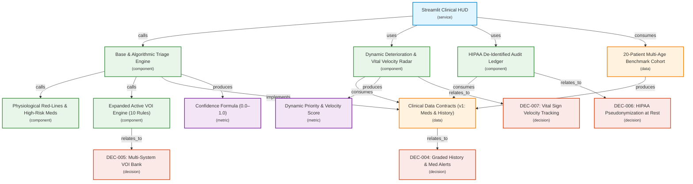

# PatientTriage.ai — System Architecture & Technical Specification

## 1. System Topology & Distributed Blueprint

```
                     +----------------------------------------------+
                     |           Clinical Client Fleet              |
                     |  (Nurse Workstations, Tablets, Intake HUD)   |
                     +----------------------------------------------+
                                            │
                                            ▼ (REST / UI State / WebSocket)
+───────────────────────────────────────────────────────────────────────────────────────────+
|                                 Application / Service Layer                               |
|                                                                                           |
|  +-----------------------+      +-------------------+      +---------------------------+  |
|  |   BaseTriageEngine    |      |    VOI Engine     |      |    Deterioration Radar    |  |
|  |  (Algorithmic / ML)   |◄────►|   (Active Q&A)    |◄────►|   (Queue & Surge Mgmt)    |  |
|  +-----------┬-----------+      +---------┬---------+      +-------------┬-------------+  |
|              │                            │                              │                |
+──────────────┼────────────────────────────┼──────────────────────────────┼────────────────+
               ▼                            ▼                              ▼
+───────────────────────────────────────────────────────────────────────────────────────────+
|                                   Repository Abstraction                                  |
|                                                                                           |
|              +────────────────────────────+   +────────────────────────────+              |
|              |      QueueRepository       |   |      AuditRepository       |              |
|              +──────────────┬─────────────+   +──────────────┬─────────────+              |
+─────────────────────────────┼────────────────────────────────┼────────────────────────────+
                              │                                │
                ┌─────────────┴─────────────┐    ┌─────────────┴─────────────┐
                ▼                           ▼    ▼                           ▼
        [In-Memory Store]             [NATS JetStream] [Local JSON/WAL]   [PostgreSQL DB]
      (Local Dev / <1µs)               (Prod Queue)   (Local Dev)       (Audit Ledger)
```

### Component Flow Diagram (Mermaid)



---

## 2. Latency Budget & Asymmetric Safety Principles

### 2.1 Latency Budget SLA
| Pipeline Stage | Budget Target | Measured v1 Baseline |
| :--- | :--- | :--- |
| **Intake Parsing & Validation** | $<5\text{ms}$ | $\approx 0.1\text{ms}$ (Pydantic v2) |
| **Physiological & Medication Rules** | $<10\text{ms}$ | $\approx 0.2\text{ms}$ (Declarative Registry) |
| **Expanded VOI Entropy Check (10 Rules)** | $<15\text{ms}$ | $\approx 0.3\text{ms}$ |
| **Vital Velocity & Queue Re-ranking** | $<20\text{ms}$ | $\approx 0.3\text{ms}$ (20-patient queue) |
| **Total Intake-to-Score SLA** | **$<50\text{ms}$** | **$\approx 0.9\text{ms}$** |

### 2.2 Asymmetric Clinical Safety Bias
Missing an emergent patient (**under-triage**) carries catastrophic risk compared to over-prioritizing a stable patient (**over-triage**):
$$\text{Loss}(\text{True ESI } 1/2 \to \text{Assigned ESI } 3/4) \gg \text{Loss}(\text{True ESI } 4 \to \text{Assigned ESI } 3)$$

- **Safety Bias Invariant:** Whenever confidence falls below $70\%$ on ambiguous or high-risk presentations, the engine automatically escalates urgency by $+1$ tier.

---

## 3. Mathematical Models & Queue Dynamics (v1 Refinements)

### 3.1 Graded Epistemic Confidence Formula
$$\text{Confidence} = 1.0 - P_{\text{data}} - P_{\text{vitals}} - P_{\text{ambiguity}} - P_{\text{age\_risk}}$$
- **$P_{\text{data}}$ (Graded History Penalty):**
  - $0.15$ if zero history and zero medications.
  - $0.08$ if partial history (only allergies or incomplete notes).
  - $0.00$ for comprehensive clinical history with medication reconciliation.
- **$P_{\text{vitals}}$:** $0.10$ for borderline physiological parameters.
- **$P_{\text{ambiguity}}$:** $0.20$ for high-entropy differential complaints (e.g. non-specific fatigue, dizziness, acute abdominal pain).
- **$P_{\text{age\_risk}}$:** $0.10$ for extreme age brackets (infants $<1$ yo, geriatrics $>75$ yo).

### 3.2 Dynamic Queue Priority with Vital Velocity ($\Delta\text{Vitals}$)
$$\text{Priority Score} = (6 - \text{ESI}) \times 100 + \left(\frac{\text{Wait Time}}{\text{Safe Threshold}}\right) \times 50 + \Delta \text{Vitals Penalty} + \text{Pain Penalty}$$

**Vital Velocity Penalty ($\Delta\text{Vitals}$):**
$$\Delta \text{Vitals Penalty} = 2.0 \times \Delta\text{HR} + 2.5 \times (-\Delta\text{SBP}) + 4.0 \times (-\Delta\text{SpO}_2)$$
*(Computed when serial vitals are re-recorded in the waiting room to catch rapid decompensation before breach)*

---

## 4. Future Horizon (v2) Strategic Architecture

| Pillar | Focus Area | Chosen v2 Standard | Rationale & Trade-offs |
| :--- | :--- | :--- | :--- |
| **Pillar 1** | **EHR Interoperability** | **Embedded FastAPI FHIR v4 Gateway** | Exposes `/Observation` and `/Patient` endpoints; validates directly into Pydantic models for live bedside monitor streaming. |
| **Pillar 2** | **Distributed Mesh** | **NATS JetStream + SQLite/WAL** | Minimal friction adoption (single binary, zero external DB required); scales to millions of messages/sec across multi-nurse tablet fleets. |
| **Pillar 3** | **Clinical SLM Core** | **Gemma-2-2B / Qwen2.5-1.5B (LoRA)** | Medically aligned, sub-3B parameter model runnable 100% locally on clinician CPU/modest GPU; fine-tunable on local hospital discharge/triage datasets. |
| **Pillar 4** | **Facility Profiler** | **Declarative YAML Facility Schema** | Dynamic rules adapting resource definitions and safe wait times for Level-1 Trauma vs Rural Access clinics. |

---

## 5. Regulatory & Audit Guarantees
1. **HIPAA Safe Harbor De-Identification:** Patient names are never written plaintext to disk; audit logs store deterministic SHA-256 tokens (`PT-HASH8`) with age brackets only.
2. **Advisory Decision Support:** Recommendations never autonomously commit diagnoses or medical orders (aligned with FDA CDS / EU MDR Annex VIII Rule 11).
3. **Mandatory Override Rationale:** Clinician overrides enforce a mandatory clinical justification text string before persisting to `audit_log.json`.