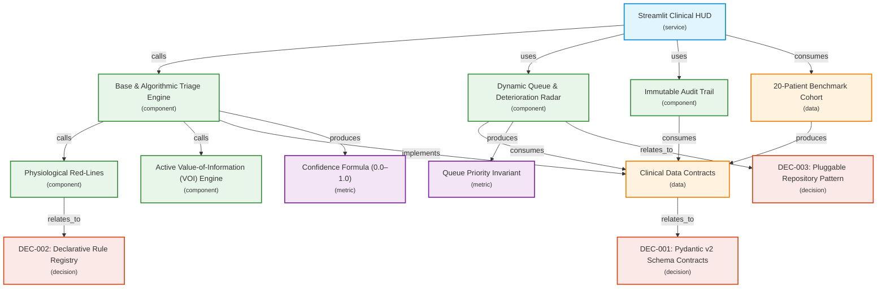

# PatientTriage.ai — System Architecture & Technical Specification

## 1. System Topology & Distributed Blueprint

```
                     +----------------------------------------------+
                     |           Clinical Client Fleet              |
                     |  (Nurse Workstations, Tablets, Intake HUD)   |
                     +----------------------------------------------+
                                            │
                                            ▼ (REST / UI State)
+───────────────────────────────────────────────────────────────────────────────────────────+
|                                 Application / Service Layer                               |
|                                                                                           |
|  +-----------------------+      +-------------------+      +---------------------------+  |
|  |   BaseTriageEngine    |      |    VOI Engine     |      |    Deterioration Radar    |  |
|  |  (Algorithmic / ML)   |◄────►|   (Active Q&A)    |◄────►|   (Queue & Surge Mgmt)    |  |
|  +-----------┬-----------+      +---------┬---------+      +-------------┬-------------+  |
|              │                            │                              │                |
+──────────────┼────────────────────────────┼──────────────────────────────┼────────────────+
               ▼                            ▼                              ▼
+───────────────────────────────────────────────────────────────────────────────────────────+
|                                   Repository Abstraction                                  |
|                                                                                           |
|              +────────────────────────────+   +────────────────────────────+              |
|              |      QueueRepository       |   |      AuditRepository       |              |
|              +──────────────┬─────────────+   +──────────────┬─────────────+              |
+─────────────────────────────┼────────────────────────────────┼────────────────────────────+
                              │                                │
                ┌─────────────┴─────────────┐    ┌─────────────┴─────────────┐
                ▼                           ▼    ▼                           ▼
        [In-Memory Store]             [Redis Cache] [Local JSON/WAL]   [PostgreSQL DB]
      (Local Dev / <1µs)               (Prod Queue)   (Local Dev)       (Audit Ledger)
```

### Component Flow Diagram (Mermaid)



---

## 2. Latency Budget & Asymmetric Safety Principles

### 2.1 Latency Budget SLA
| Pipeline Stage | Budget Target | Deterministic Core Measured |
| :--- | :--- | :--- |
| **Intake Parsing & Validation** | $<5\text{ms}$ | $\approx 0.1\text{ms}$ (Pydantic v2) |
| **Physiological Rule Evaluation** | $<10\text{ms}$ | $\approx 0.2\text{ms}$ (Declarative Registry) |
| **VOI Entropy Check** | $<15\text{ms}$ | $\approx 0.3\text{ms}$ |
| **Queue Re-ranking & Deterioration Score** | $<20\text{ms}$ | $\approx 0.2\text{ms}$ (20-patient queue) |
| **Total Intake-to-Score SLA** | **$<50\text{ms}$** | **$\approx 0.8\text{ms}$** |

### 2.2 Asymmetric Clinical Safety Bias
Missing an emergent patient (**under-triage**) carries catastrophic risk compared to over-prioritizing a stable patient (**over-triage**):
$$\text{Loss}(\text{True ESI } 1/2 \to \text{Assigned ESI } 3/4) \gg \text{Loss}(\text{True ESI } 4 \to \text{Assigned ESI } 3)$$

- **Safety Bias Invariant:** Whenever confidence falls below $70\%$ on ambiguous or high-risk presentations, the engine automatically escalates urgency by $+1$ tier.

---

## 3. Mathematical Models & Queue Dynamics

### 3.1 Confidence Metric Formula
$$\text{Confidence} = 1.0 - P_{\text{data}} - P_{\text{vitals}} - P_{\text{ambiguity}} - P_{\text{age\_risk}}$$
- $P_{\text{data}} = 0.15$ if patient has zero medical history.
- $P_{\text{vitals}} = 0.10$ for borderline physiological parameters.
- $P_{\text{ambiguity}} = 0.20$ for high-entropy differential complaints (e.g. non-specific fatigue, dizziness).
- $P_{\text{age\_risk}} = 0.10$ for extreme age brackets (infants $<1$ yo, geriatrics $>75$ yo).

### 3.2 Dynamic Queue Priority Invariant
$$\text{Priority Score} = (6 - \text{ESI}) \times 100 + \left(\frac{\text{Wait Time}}{\text{Safe Threshold}}\right) \times 50 + \Delta \text{Vitals Penalty}$$

**Safe Wait Time Thresholds:**
- **ESI 1 (Resuscitation):** $0\text{ min}$ (Immediate bedding)
- **ESI 2 (Emergent):** $10\text{ min}$ max wait
- **ESI 3 (Urgent):** $30\text{ min}$ max wait
- **ESI 4 (Less Urgent):** $60\text{ min}$ max wait
- **ESI 5 (Non-Urgent):** $120\text{ min}$ max wait

---

## 4. Module Registry & Contracts

| Module | Interface / Class | Responsibility | Reference |
| :--- | :--- | :--- | :--- |
| `triage.models` | `PatientRecord`, `Vitals`, `TriageResult` | Pydantic v2 data boundary validation | [DEC-001](file:///C:/Code/patient-triage/decisions.md#dec-001) |
| `triage.rules` | `RuleRegistry`, `PEWS`, `NEWS2`, `qSOFA` | Age-adjusted physiological red-lines | [DEC-002](file:///C:/Code/patient-triage/decisions.md#dec-002) |
| `triage.engine` | `BaseTriageEngine`, `AlgorithmicTriageEngine` | Swappable triage scoring core | [handoff.md §3.2](file:///C:/Code/patient-triage/handoff.md#32-swappable-engine-contract-triageenginepy) |
| `triage.voi` | `ValueInformationEngine` | Active entropy-reducing clinical questioning | [handoff.md §4](file:///C:/Code/patient-triage/handoff.md#4-confidence-metric--active-voi-question-engine) |
| `triage.queue` | `TriageQueue`, `DeteriorationTracker` | Priority ordering, breach alarms, 3× surge | [handoff.md §5](file:///C:/Code/patient-triage/handoff.md#5-dynamic-queue-deterioration--3-surge-engine) |
| `triage.audit` | `AuditRepository`, `JSONAuditLogger` | Immutable log & override justification | [DEC-003](file:///C:/Code/patient-triage/decisions.md#dec-003) |
| `triage.cohort` | `BENCHMARK_COHORT_20` | 20-patient synthetic validation suite | [handoff.md §7](file:///C:/Code/patient-triage/handoff.md#7-the-20-patient-benchmark-cohort-triagecohortpy) |

---

## 5. Regulatory & Audit Guarantees
1. **Advisory Decision Support:** Recommendations never autonomously commit diagnoses or medical orders (aligned with FDA CDS / EU MDR Annex VIII Rule 11).
2. **Clinician In-the-Loop:** All automated recommendations can be overridden by a registered clinician with a single click, capturing a mandatory rationale string.
3. **Immutable Audit Ledger:** All triage events, VOI interactions, and overrides are recorded append-only to `audit_log.json` with microsecond timestamps and user IDs.